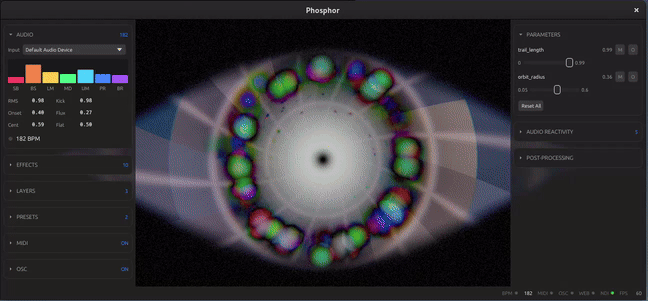

# Phosphor


**Cross-platform real-time particle and shader engine for live performance. Welcome to the light.**

| | |
|---|---|
| **Rendering** | Native GPU app (Vulkan/Metal via wgpu) · Shader hot-reload (edit WGSL live) |
| **Audio** | BPM detection (FFT autocorrelation + Kalman filter) · 7-band spectral analysis · Beat sync |
| **Compositing** | 8-layer stack · 7 blend modes · GPU compute particles · Media/video layers (GIF/PNG/MP4) |
| **Control** | MIDI input with learn + auto-connect · OSC in/out with learn · Web touch surface (phone/tablet) |
| **Output** | NDI (`--features ndi`, runtime-loaded) · Preset save/load (full layer stack) |

## Note from Dev

Thanks for checking this project out! I've gone through a couple experimental projects recently - [EASE](https://github.com/kevinraymond/ease) and [EASEy-GLYPH](https://github.com/kevinraymond/easey-glyph) - and with Phosphor I'm trying to put it all together.

I hope this project is genuinely useful. I've tried to make it as easy to use as possible, but I'm no kind of performer so I'm open to suggestions for improvements (drop an issue)!

Everything below here is AI-assisted, like this entire project, except for this first section. I started writing software during the time of C-64 and TRaSh-80 ... even so, I never imagined it would be at this point. Wild times.

Give it a try! Let me know how I can make it better for you.

_NOTE: Everything below here is AI-assisted content. I keep involved 100% of the time, though I AM human so sometimes I don't catch every dumb thing it does. Please drop an issue if you see something!_

---

Phosphor turns your audio input into layered, beat-synced visuals using GPU shaders, particles, and compositing — all driven by WGSL and controlled via MIDI, OSC, or a phone browser.

<p align="center">
  
</p>

## Quick Start

**Prerequisites:** Rust 1.90+, an audio input device, a Vulkan-capable GPU. Optional: [ffmpeg](https://ffmpeg.org/) on PATH for video layer support.

```bash
git clone https://github.com/kevinraymond/phosphor.git
cd phosphor
cargo run --release                # standard build
cargo run --release --features video  # with video layer support (requires ffmpeg)
```

On first launch: press **D** to show the UI, pick an effect from the browser, and press **F** for fullscreen. Audio reactivity works immediately from your default input device.

## Controls

### Keyboard

| Key | Action |
|-----|--------|
| `D` | Toggle UI overlay |
| `F` | Toggle fullscreen |
| `[` / `]` | Cycle active layer |
| `Tab` | Cycle UI widgets |
| `Esc` | Quit |

### MIDI

Any MIDI controller works. Plug in and use MIDI learn:

1. Click the **M** button next to any parameter
2. Move a knob or press a button on your controller
3. The binding saves automatically to `~/.config/phosphor/midi.json`

Trigger actions (next/prev effect, layer, preset, toggle post-processing) can also be MIDI-learned.

### OSC

| Port | Direction | Default |
|------|-----------|---------|
| 9000 | Receive | On |
| 9001 | Transmit | Off (enable in UI) |

Addresses: `/phosphor/param/{name}`, `/phosphor/trigger/{action}`, `/phosphor/layer/{n}/opacity`, `/phosphor/layer/{n}/blend`, `/phosphor/layer/{n}/enabled`, `/phosphor/postprocess/enabled`.

OSC learn works the same as MIDI learn — click the **O** button, send any message to bind.

### Web Touch Control

When enabled in the UI, a touch-friendly control surface is served at:

```
http://localhost:9002
```

Open it on a phone or tablet on the same network. Supports multiple simultaneous clients with live audio visualization, effect selection, param sliders, and layer management.

## Effects

| Effect | Description | Features |
|--------|-------------|----------|
| **Aurora** | Horizontal flowing curtains driven by 7 frequency bands | |
| **Drift** | Triple domain-warped FBM fluid smoke | Feedback |
| **Tunnel** | Log-polar infinite cylindrical flythrough | |
| **Prism** | Kaleidoscopic N-fold mirror symmetry with FBM | |
| **Shards** | Animated Voronoi cells with stained-glass fill | |
| **Pulse** | Beat-synced concentric rings with trails | Feedback |
| **Iris** | Spinning dot with fading feedback trails | Feedback |
| **Swarm** | Orbital particle cloud with custom compute shader | Feedback, Particles |
| **Storm** | Volumetric clouds with beat-triggered lightning | Feedback |

All effects are audio-reactive out of the box. Parameters are exposed as sliders in the UI and mappable to MIDI/OSC.

## Layers

- Up to **8 layers** composited on the GPU
- **7 blend modes**: Normal, Add, Multiply, Screen, Overlay, Soft Light, Difference
- Per-layer **opacity**, **enable/disable**, **lock** (freezes all settings), **pin** (prevents reorder)
- **Drag-and-drop** reordering in the layer panel
- **Media layers**: load PNG/JPEG/GIF/WebP as compositing layers with letterbox fit and animated playback
- **Video layers** (with `--features video`): MP4/MOV/AVI/MKV/WebM pre-decoded to RAM for instant scrub and seek (requires ffmpeg, 60s max)
- **Post-processing**: bloom, chromatic aberration, ACES tonemapping, vignette, film grain (audio-reactive)

## Presets

- Save/load the entire layer stack (effects, params, blend modes, opacities) as named presets
- Stored in `~/.config/phosphor/presets/` as JSON
- Cycle presets via MIDI/OSC triggers or the preset panel
- Locked layers are preserved during preset load
- Bundled preset: **Crucible** (all 8 layers composited)

## Configuration

All config is stored in `~/.config/phosphor/`:

| File | Contents |
|------|----------|
| `midi.json` | MIDI port, CC/trigger bindings |
| `osc.json` | OSC ports, address bindings |
| `web.json` | Web control surface port, enable state |
| `presets/*.json` | Named presets |

## Writing Effects

Effects are WGSL fragment shaders paired with a JSON `.pfx` definition. Shaders have access to time, resolution, 20 audio features (7 frequency bands, beat detection, spectral shape), up to 16 parameters, feedback from the previous frame, and a built-in library (noise, palette, SDF, tonemap).

Edit a shader while running — it hot-reloads on save with error recovery.

See [TECHNICAL.md](TECHNICAL.md#shader-authoring-guide) for the full authoring guide, uniform reference, multi-pass pipelines, and particle system integration.

## Contributing

See [CONTRIBUTING.md](CONTRIBUTING.md) for build instructions, the effect creation walkthrough, and PR guidelines.

## License

Dual-licensed under [MIT](LICENSE-MIT) or [Apache 2.0](LICENSE-APACHE), at your option.
