<div align="center">

# Fosfora

**Turn whatever your computer is playing into live, beat-synced visuals.**

[](https://github.com/kevinraymond/fosfora/actions/workflows/ci.yml)
[](https://github.com/kevinraymond/fosfora/releases/latest)
[](#license)

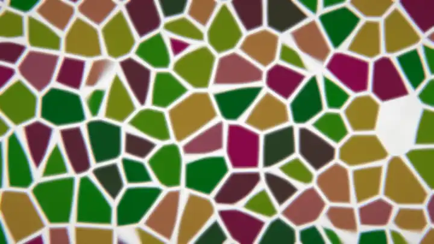

### [⬇&nbsp; Download for macOS, Windows or Linux](https://github.com/kevinraymond/fosfora/releases/latest)

</div>

Fosfora is a free, open-source music visualizer built for actually performing with. There's
nothing to code, no account to make, and no project to set up: open it, play music, and it
reacts. When you want more, every knob is there — 40 effects, an eight-layer stack, MIDI, OSC,
your phone as a control surface, a webcam, and NDI out to your video mixer.

## See it move

Six of the thirty-eight, all at default settings:

<table>
<tr>
<td width="33%">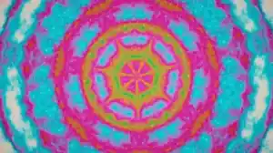<br><b>Prism</b><br><sub>Kaleidoscopic mirror symmetry</sub></td>
<td width="33%">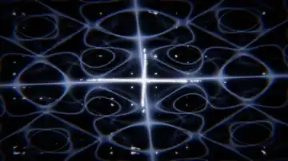<br><b>Cymatics</b><br><sub>Chladni standing waves, per band</sub></td>
<td width="33%">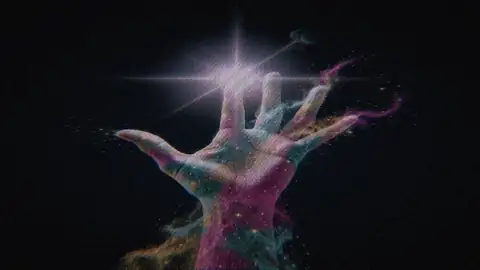<br><b>Morph</b><br><sub>Particles spring between images</sub></td>
</tr>
<tr>
<td>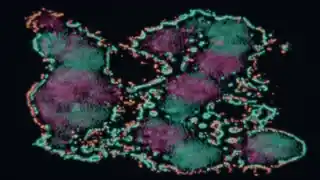<br><b>Genesis</b><br><sub>Two species, self-organizing</sub></td>
<td>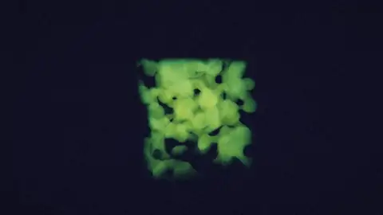<br><b>Lattice Clouds</b><br><sub>3D cellular automata, ray-marched</sub></td>
<td>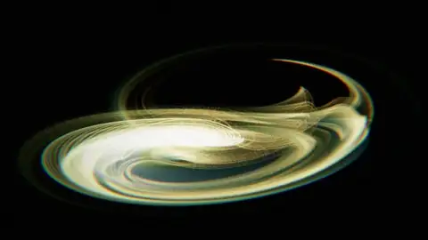<br><b>Chaos</b><br><sub>Strange attractors</sub></td>
</tr>
</table>

**→ [See all 40 effects in the gallery](docs/GALLERY.md)**

## Past the defaults

Those are effects out of the box. This is what the rest of the app does to them — six
setups you can build from the panels, each one a preset you can save and recall:

<table>
<tr>
<td width="33%">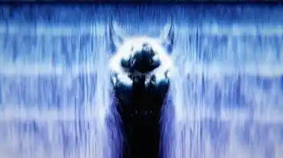<br><b>Flow around a body</b><br><sub>Water parts around a silhouette — a photo, or your webcam</sub></td>
<td width="33%">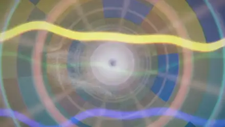<br><b>Four layers, blended</b><br><sub>Voronoi and curtains screened over a particle flock</sub></td>
<td width="33%">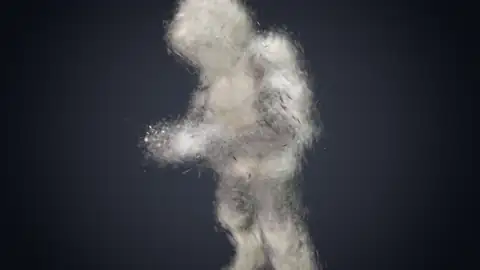<br><b>A 3D capture, playing</b><br><sub>A photoscan rounded into points, breathing with the mix</sub></td>
</tr>
<tr>
<td>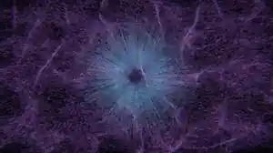<br><b>Wired to the music</b><br><sub>Drums, harmony and the drop on separate parameters</sub></td>
<td>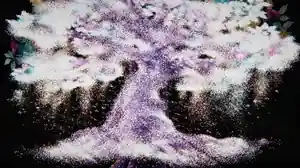<br><b>Your own image, as particles</b><br><sub>Bass shoves it apart, springs pull it back</sub></td>
<td>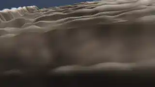<br><b>Cued and dissolved</b><br><sub>Presets chained into a set, crossfading on cue</sub></td>
</tr>
</table>

**→ [How to build these](docs/TUTORIALS.md)** · the presets behind them are in
[`scripts/capture/demos/`](scripts/capture/demos)

## Your first 60 seconds

Three steps, and you can't break anything — every setting saves to its own file and can be reset.

1. **Download and open it.** A visual is already running when the window appears. The panels
   fade in after a second or two, or press **D** to show them right away.
2. **Point it at your audio.** This is the one step worth getting right — see
   [below](#the-visuals-arent-reacting-to-my-music) if nothing moves. Most of the time it just
   works.
3. **Play something.** Click effects on the left until one grabs you, then press **F** for
   fullscreen.

<p align="center">
  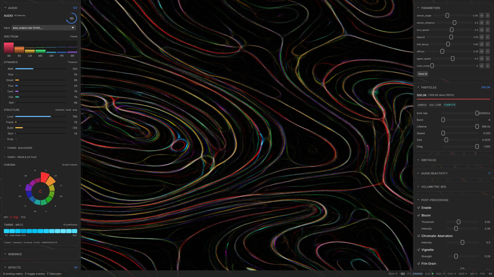
</p>

NDI® output is built into the official downloads — to use it, install the
[NDI® runtime](https://ndi.video). That's the only extra step anything here needs.

<details>
<summary><strong>Build from source instead</strong></summary>

Needs Rust 1.97+ (pinned via `rust-toolchain.toml`) and a Vulkan-capable GPU.

```bash
git clone https://github.com/kevinraymond/fosfora.git
cd fosfora
cargo run --release                    # no extra deps
cargo run --release --features video   # video layers — needs ffmpeg on PATH
cargo run --release --features webcam  # webcam layers — needs libclang-dev, v4l-utils (Linux)
cargo run --release --features ndi     # NDI out — needs the NDI runtime
cargo run --release --features depth   # webcam + MiDaS depth — needs libssl-dev, libclang-dev
```

</details>

## What you can do with it

|  |  |
|---|---|
| **Stack and blend** | Layers work like Photoshop or OBS — up to 8 of them, 10 blend modes, drag to reorder. Put a slow shader under a particle storm, dial the opacity, and it's a new look. Layers can also be images, GIFs, video files or a live webcam, not just effects. |
| **Perform it live** | Map any MIDI knob to any parameter by clicking **M** and wiggling the knob. Same for OSC. Or open your phone's browser and use it as a touch surface — no app to install. |
| **It genuinely listens** | Not just "loud = big". Fosfora tracks 74 things about your music 86 times a second — beat and tempo, key and chord, drums separated from melody, the moment a build turns into a drop — and any of them can drive any parameter. |
| **Bring the room in** | Feed it a webcam and let particles flow around your silhouette, or a photo, or a depth map. Hand and body tracking stream in over the [bridges](bridges/README.md). |
| **Send it anywhere** | NDI out to your video mixer, or record straight to a file — H.264, HEVC or AV1 in MP4 or MKV, up to 8K, hardware-encoded, with the audio muxed in. |
| **Save the moment** | Presets store your whole layer stack. Scenes chain them into a cue list that advances on a timer, on the beat, or when you hit the spacebar. |
| **Make it yours** | Every effect is a WGSL shader you can open in the built-in editor and edit while it's running — it recompiles on save and tells you where you broke it. |

## The effects

**40 built-in**, all audio-reactive out of the box, every parameter a slider you can map to
MIDI or OSC. [Full gallery with clips →](docs/GALLERY.md)

**Shaders** — Aurora · Beam · Drift · Frost · Iris · Prism · Pulse · Shards · Storm · Strata · Tunnel

**Particle simulations** — Accretion · Array · Cascade · Chaos · Cleave · Cymatics · Flux ·
Genesis · Morph · Murmur · Mycelium · Polycephalum · Raster · Splat · Symbiosis · Tesla · Tide ·
Turing · Vessel

**Lattice** (3D cellular automata, ray-marched) — 445 · Brain · Builder · Chunky · Clouds ·
Pulse · Pyroclastic · Shells

Any particle effect can also be switched into **Volumetric** mode, which renders the layer
you're on as ray-marched fog instead of discrete points — the same simulation, made of smoke.

## Controls

| Key | Action |
|-----|--------|
| `D` | Show / hide the UI |
| `F` | Fullscreen |
| `B` | Binding matrix |
| `[` `]` | Previous / next layer |
| `Space` | Next scene cue |
| `T` | Play / pause the scene timeline |
| `Esc` | Quit |

**Binding matrix** (press **B**) — a full-screen patch bay. Drag a line from any source (a MIDI
knob, an OSC message, an audio feature, your phone, a hand-tracking bridge) to any target (a
slider, layer opacity, a particle setting) and it moves with the music or with you.

**MIDI** — click the **M** next to any parameter, move a knob, done. Auto-connects and hot-plugs.

**OSC** — receives on port 9000, transmits on 9001. Click **O** next to a parameter and send any
message to bind it, or address things directly:
`oscsend localhost 9000 /phosphor/param/warp_intensity f 0.8`.
[Full address list →](docs/QUICK-REFERENCE.md)

**Your phone** — enable the web surface and open `http://<this-machine>:9002` on any phone or
tablet on the same network. Multiple people can connect at once.

## Documentation

| | |
|---|---|
| [**Gallery**](docs/GALLERY.md) | Every effect, in motion |
| [**Tutorials**](docs/TUTORIALS.md) | The full guide — effects, audio, layers, scenes, MIDI, OSC |
| [**Quick reference**](docs/QUICK-REFERENCE.md) | Shortcuts, blend modes, OSC addresses, config files |
| [**Audio features**](docs/AUDIO-FEATURES.md) | All 74 features in plain English, and the research behind them |
| [**Technical**](docs/TECHNICAL.md) | Architecture, shader authoring, the `.pfx` format |
| [**Credits**](docs/CREDITS.md) | The libraries and papers this is built on |

Settings, presets, scenes and mappings all live in `~/.config/phosphor/` (and the equivalent on
macOS and Windows). Delete it to reset; nothing else on your system is touched.

## FAQ

**<a id="the-visuals-arent-reacting-to-my-music"></a>The visuals aren't reacting to my music.**
Fosfora listens to an *input* device. Open the **Audio** panel and pick the right source:
- **Linux** — pick the **Monitor** of your output device. That's your system audio; a plain
  microphone only hears the room.
- **Windows** — pick the WASAPI **loopback** device for system audio, or a mic for the room.
- **macOS** — the default input is your mic. To visualize system audio, route it with a loopback
  tool such as BlackHole.

**I just get a black screen, or it won't start.**
Fosfora needs a Vulkan-capable GPU (Vulkan on Linux and Windows, Metal on macOS). Update your
graphics drivers first.

**macOS says it can't verify the app.**
The official `.dmg` is signed and notarized, so downloading and dragging should just work. If
macOS still blocks it, right-click the app → **Open** the first time.

**Can I use it with my VJ software?**
Yes — turn on NDI and it shows up as a source in Resolume, OBS, TouchDesigner and anything else
that speaks NDI. Or record to a file and drop that in.

## From the dev

Thanks for checking this project out! I've gone through a couple experimental projects recently -
[EASE](https://github.com/kevinraymond/ease) and
[EASEy-GLYPH](https://github.com/kevinraymond/easey-glyph) - and with Fosfora I'm trying to put
it all together.

I hope this project is genuinely useful. I've tried to make it as easy to use as possible, but
I'm no kind of performer so I'm open to suggestions for improvements (drop an issue)!

I started writing software during the time of C-64 and TRaSh-80, and even with the field of AI
"before it was cool" ... even so, I never imagined we would get to the point where I can
architect and design and not need to write out everything. Wild times.

Give it a try! Let me know how I can make it better for you.

## Contributing

New effects are the easiest way in — a WGSL shader plus a small JSON file, and it shows up in the
browser automatically. See [CONTRIBUTING.md](CONTRIBUTING.md) and the
[shader authoring guide](docs/TECHNICAL.md#shader-authoring-guide).

Built on wgpu, egui, cpal, rustfft and a lot of published research —
[full credits](docs/CREDITS.md).

## License

Dual-licensed under [MIT](LICENSE-MIT) or [Apache 2.0](LICENSE-APACHE), at your option.
